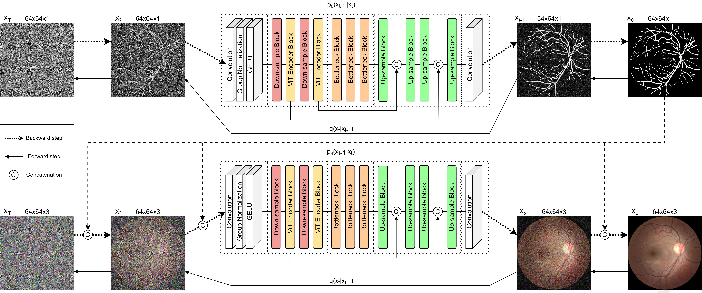

# Denoising Diffusion Probabilistic Model for Retinal Image Generation and Segmentation
## Dataset is available at the following [link](https://www.kaggle.com/datasets/alnuritoalimanov/retree-dataset).

1. Create anaconda environment using the following code: "conda env create -f env.yml".

2. Download EyeQ, DRIVE, STARE, and CHASE DB1 datasets and place them in datasets folder.

3. Segment EyeQ dataset with any segmentation model.

4. Place EyeQ images in datasets/eyeq/images/.

5. Run train_ddpm_mask.py and place generated masks in datasets/eyeq/labels/.

6. Run train_ddpm_image.py.



If you use this code, please use the following BibTeX entry.

```
@inproceedings{alimanov2023denoising,
  title={Denoising Diffusion Probabilistic Model for Retinal Image Generation and Segmentation},
  author={Alimanov, Alnur and Islam, Md Baharul},
  booktitle={2023 IEEE International Conference on Computational Photography (ICCP)},
  pages={1--12},
  year={2023},
  organization={IEEE}
}
```
